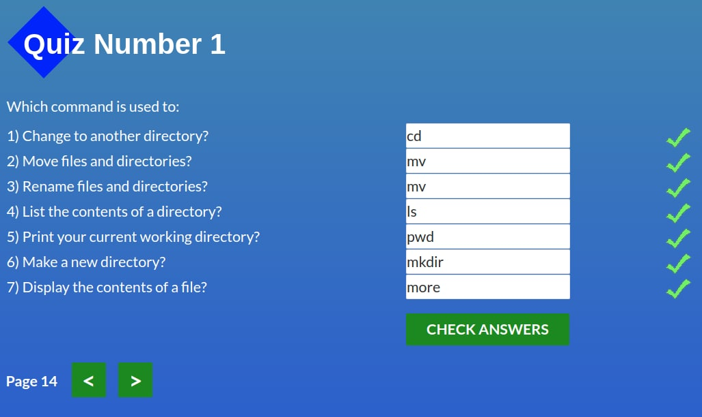
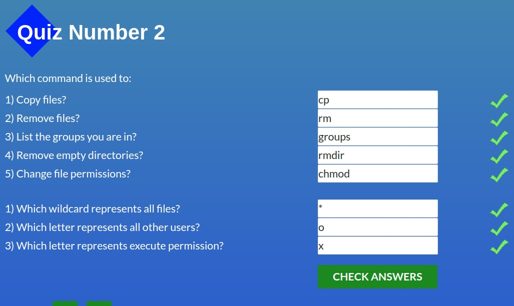
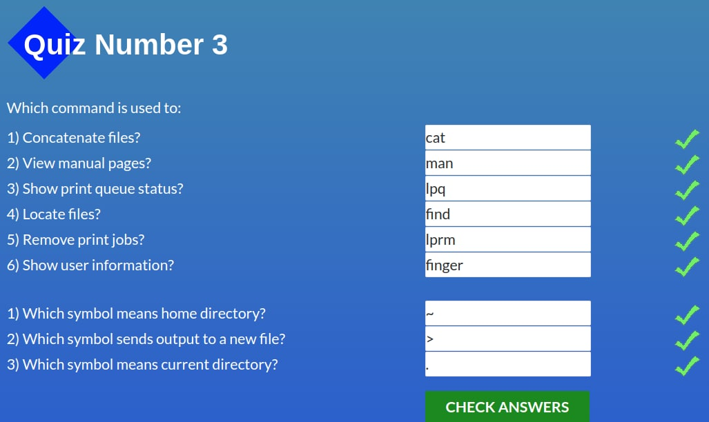
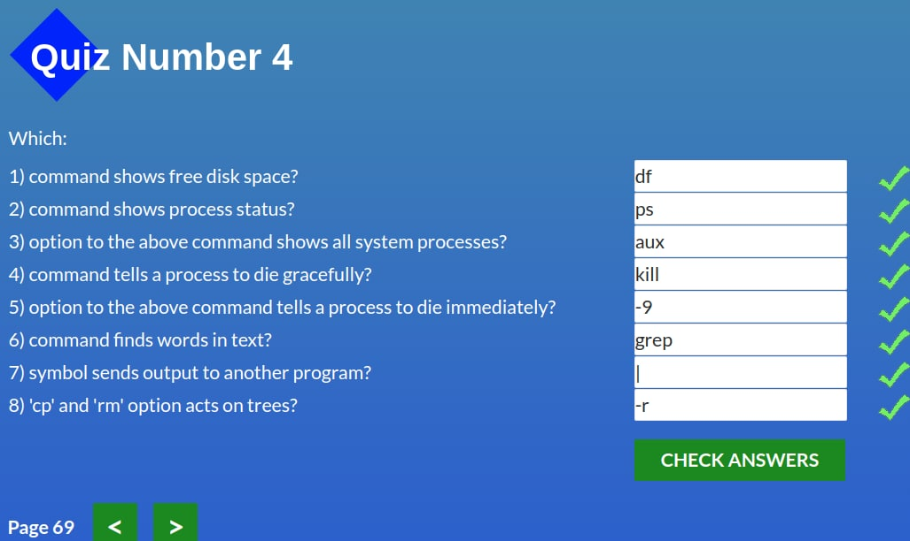
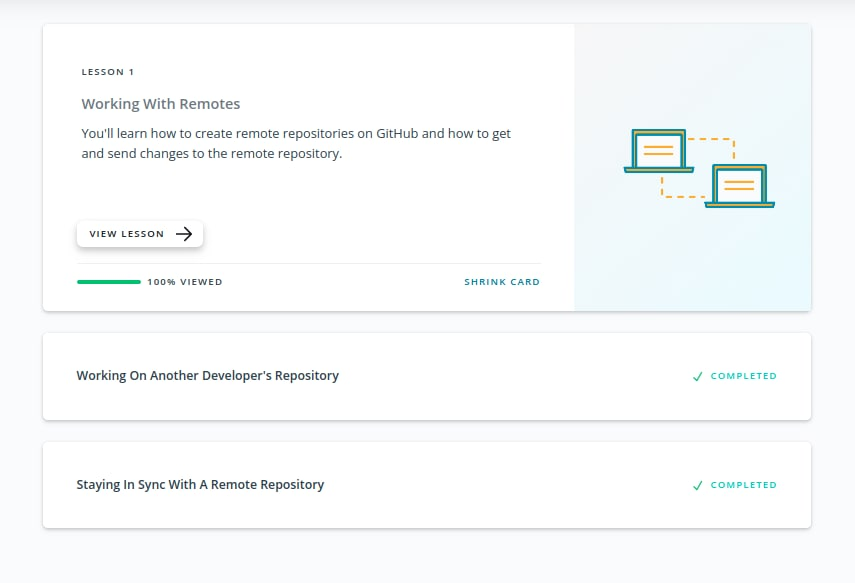

# kottans-frontend

🐈‍⬛🐈‍⬛🐈‍⬛

## 1. Git та GitHub

Refreshed my Github knowledge.

## 2. Linux CLI, and HTTP

I'm a fan of Linux and terminal.

Screenshots

## 3. Git Collaboration

I'm on my way to Git mastery.

Screenshots

<!-- ## 4. Intro to HTML and CSS

CSS hacking is my new hobby.

## 5. Responsive Web Design -->
