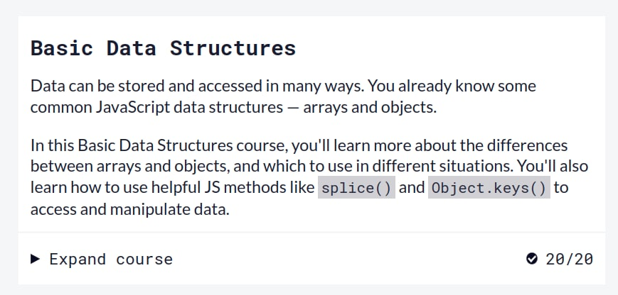

# kottans-frontend

🐈‍⬛🐈‍⬛🐈‍⬛

## 0. Git & GitHub

Refreshed my Github knowledge.

## 1. Linux CLI, and HTTP

I'm a fan of Linux and terminal.

Screenshots

## 2. Git Collaboration

I'm on my way to Git mastery.

Screenshots

## 3. Intro to HTML and CSS

CSS hacking is my new hobby.

Screenshots

## 4. Responsive Web Design

Now media queries are not magic for me (maybe not).

Screenshots

## 5. HTML & CSS Practice

[Demo Url](https://kovalov.github.io/dropdown-menu-css/)

[Codebase](https://github.com/kovalov/dropdown-menu-css)

## 6. JS Basics

Refereshing my JS knowledge and getting better in setters/getters and array methods.

Screenshots

## 7. DOM

DOM manipulations is my second nature.

Screenshots

[Demo Url](https://kovalov.github.io/kottans-dom-project/)

[Codebase](https://github.com/kovalov/kottans-dom-project)

## 8. Building a Tiny JS World

Maybe in future I will be an OOP fan.

[Demo Url](https://kovalov.github.io/a-tiny-JS-world/)

[Codebase](https://github.com/kovalov/a-tiny-JS-world)

## 9. Object Oriented JS

Have not become OOP fan yet.

### Frogger Game

[Demo Url](https://kovalov.github.io/kottans-frogger-game/)

[Codebase](https://github.com/kovalov/kottans-frogger-game)

Screenshots

## 10. OOP Exercise

OOP become more clearer to me.

[Demo Url](https://kovalov.github.io/a-tiny-JS-world/)

[Codebase](https://github.com/kovalov/a-tiny-JS-world/)

## 11. Offline Web Applications

## 12. Memory – Pair Game

With tears and struggle I have finished the game.

[Demo Url](https://kovalov.github.io/kottans-memory-game/)

[Codebase](https://github.com/kovalov/kottans-memory-game)

## 13. Website Performance Optimization

## 14. Friends App

[Demo Url](https://kovalov.github.io/kottans-friends-app/)

[Codebase](https://github.com/kovalov/kottans-friends-app)
